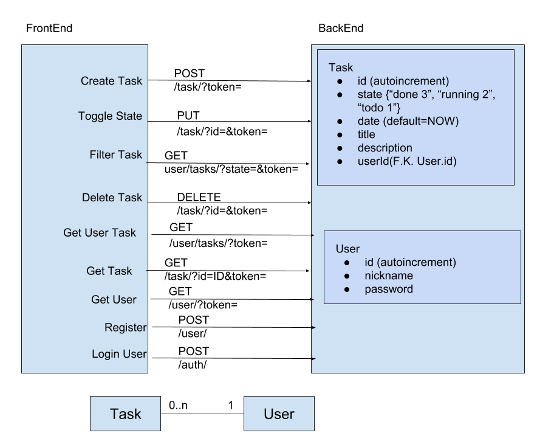

# todolist

### User 
    CREATE TABLE `my_db`.`User` ( `id` INT NOT NULL AUTO_INCREMENT , `nickname` VARCHAR(255) NOT NULL , `password` VARCHAR(255) NOT NULL , PRIMARY KEY (`id`)) ENGINE = InnoDB;
### Tag  
    CREATE TABLE `my_db`.`Tag` ( `id` INT NOT NULL AUTO_INCREMENT , `name` VARCHAR(25) NOT NULL DEFAULT 'Today' , PRIMARY KEY (`id`)) ENGINE = InnoDB;

### Task  
    CREATE TABLE `my_db`.`Task` (
        `id` INT(10) NOT NULL AUTO_INCREMENT , 
        `state` INT(1) NOT NULL DEFAULT '0' COMMENT 'todo 0, running 1, done 2' ,
        `date` DATETIME NOT NULL DEFAULT CURRENT_TIMESTAMP , 
        `title` VARCHAR(25) CHARACTER SET utf8 COLLATE utf8_bin NOT NULL , 
        `description` TEXT CHARACTER SET utf8 COLLATE utf8_bin NOT NULL , 
        `userId` INT NOT NULL , 
        PRIMARY KEY (`id`),
        FOREIGN KEY (`userId`) REFERENCES user(`id`)
    ) ENGINE = InnoDB;

### TaskTag     
    CREATE TABLE `my_db`.`TaskTag` ( `idTask` INT NOT NULL , `idTag` INT NOT NULL, 
                                FOREIGN KEY(`idTask`) REFERENCES task(`id`),
                                 FOREIGN KEY(`idTag`) REFERENCES tag(`id`)
                               ) ENGINE = InnoDB;
   
